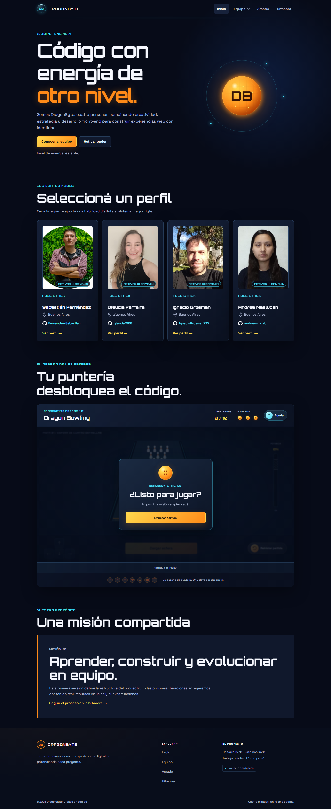
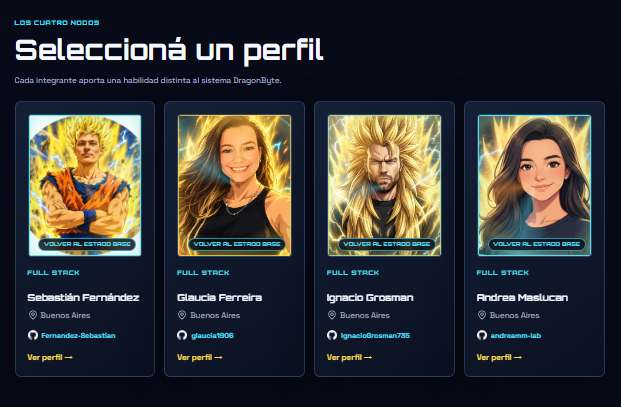
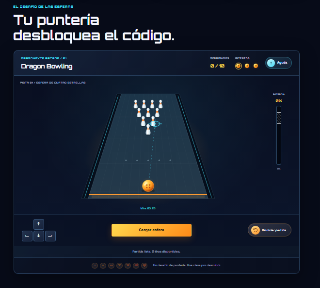
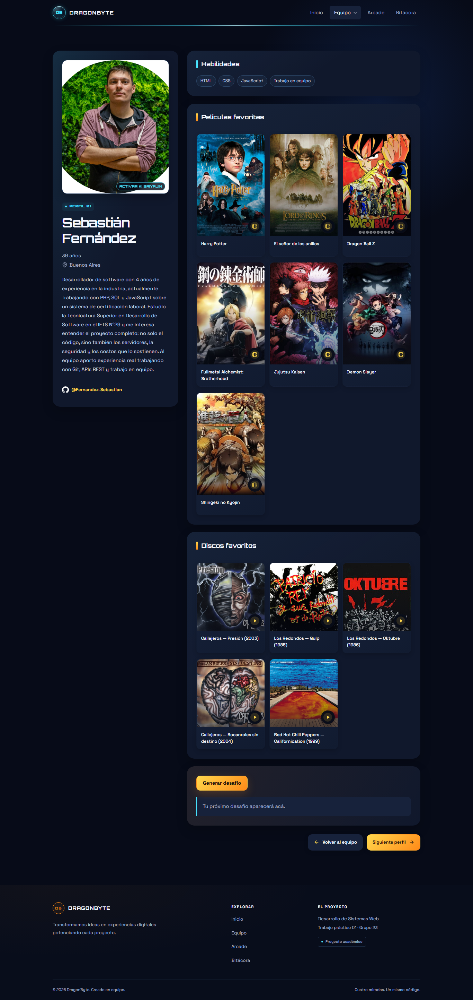
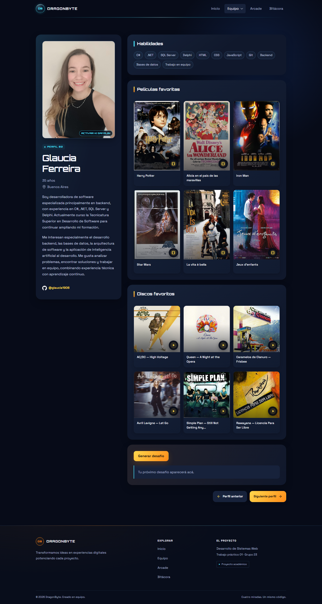
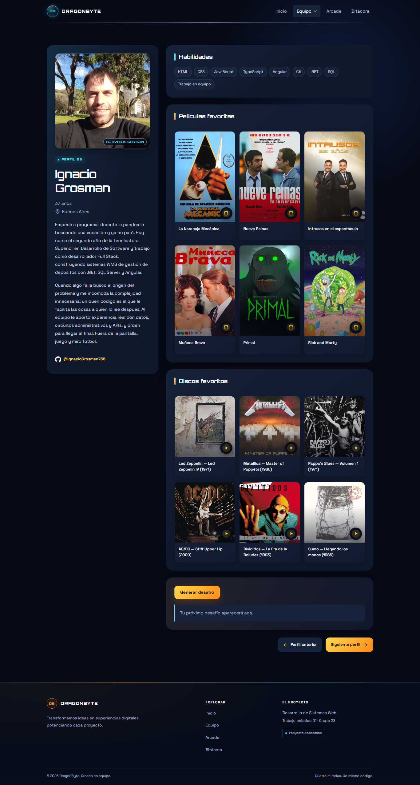
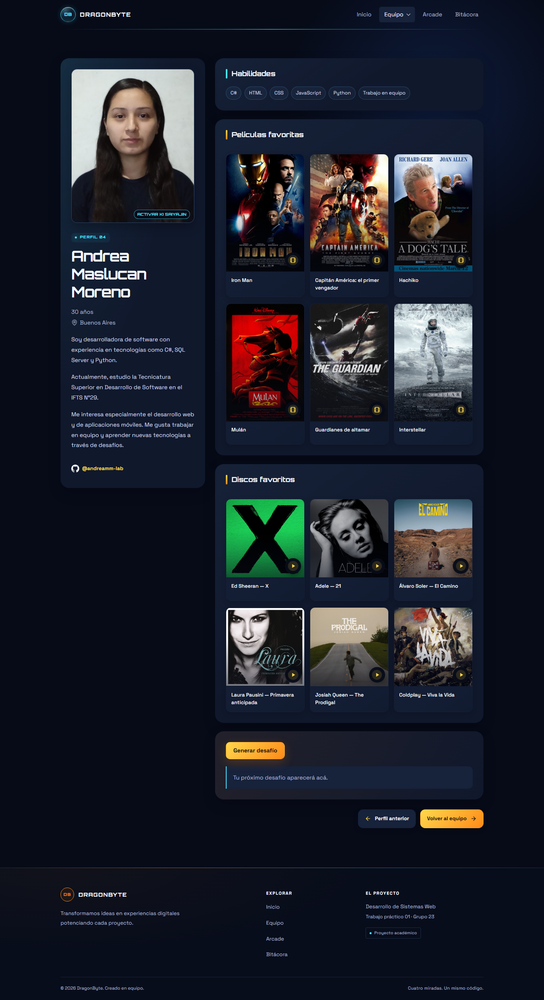
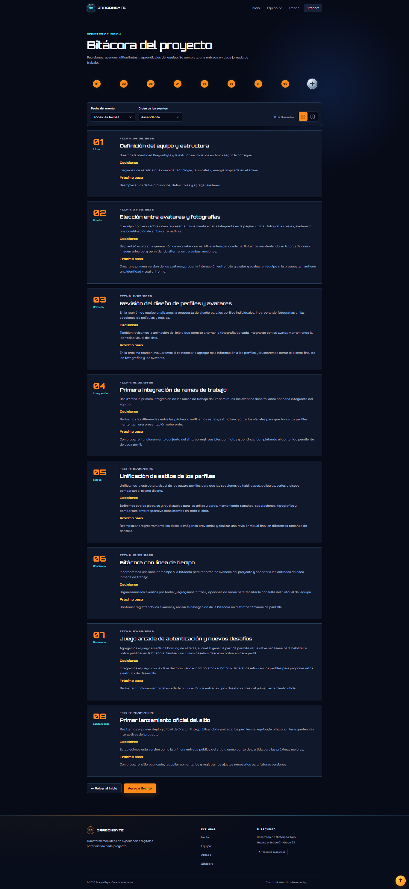
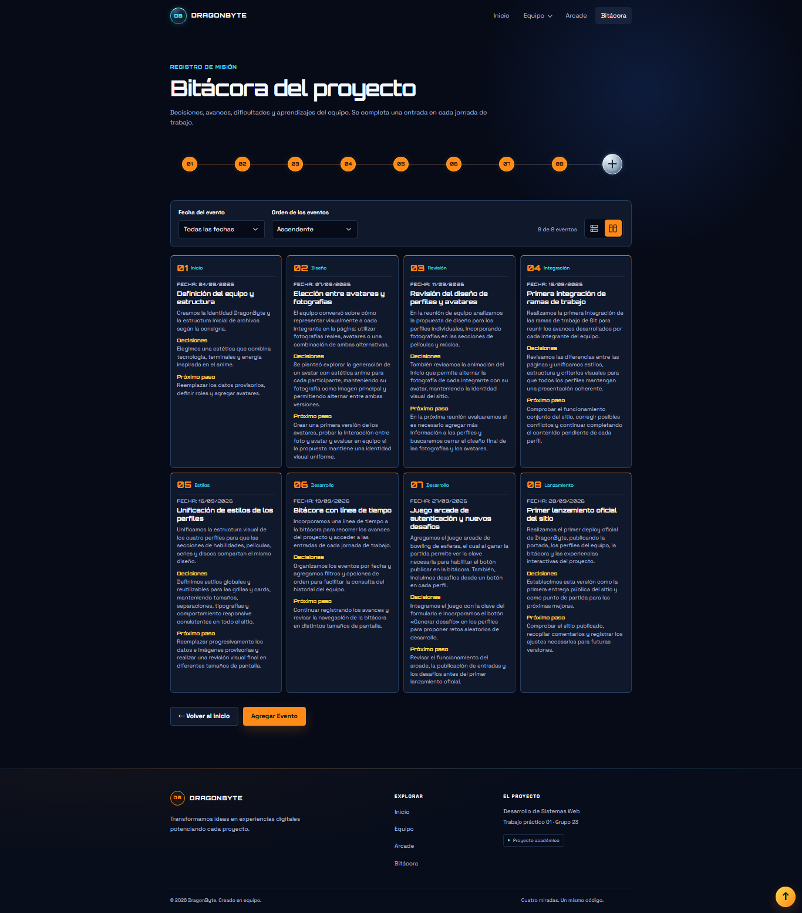
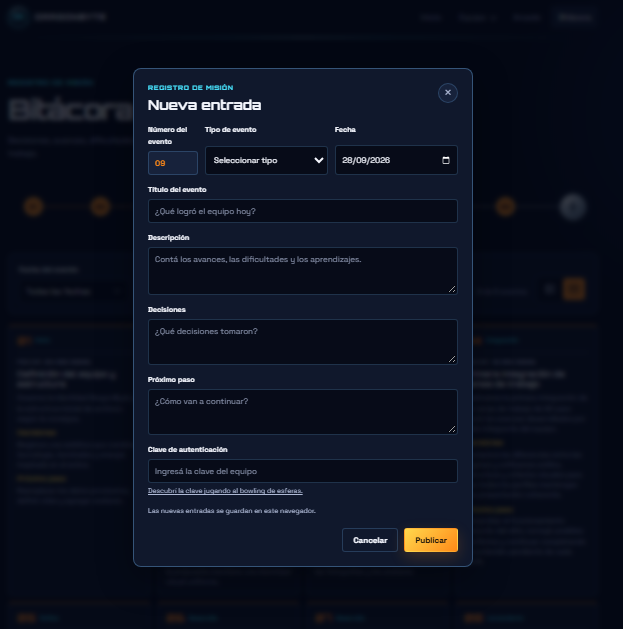

# DragonByte — TP1 Proyecto web en equipo

Sitio web grupal realizado para Desarrollo de Sistemas Web(Frontend).

Sitio en línea: [DragonByte en Vercel](https://tp-1-front-end-grupo-23.vercel.app/).

## Integrantes

- Sebastián Fernández — [GitHub](https://github.com/Fernandez-Sebastian)
- Glaucia Ferreira — [GitHub](https://github.com/glaucia1906)
- Ignacio Grosman — [GitHub](https://github.com/IgnacioGrosman735)
- Andrea Maslucan Moreno — [GitHub](https://github.com/andreamm-lab)

## Tecnologías

- HTML5
- CSS3
- JavaScript
- Google Fonts: Orbitron y Space Grotesk

## Estructura

```text
TP1_FrontEnd_Grupo_23/
├── .editorconfig
├── .gitignore
├── index.html
├── assets/
│   ├── css/
│   │   ├── base.css
│   │   └── pages/
│   │       ├── inicio.css
│   │       ├── bitacora.css
│   │       └── perfiles.css
│   ├── js/
│   │   ├── bitacora-access.js
│   │   └── pages/
│   │       ├── inicio.js
│   │       └── bitacora.js
│   └── img/
│       ├── albums/
│       ├── iconos/
│       │   ├── dragonbyte.svg
│       │   ├── github.webp
│       │   └── ubicacion.webp
│       ├── peliculas/
│       ├── perfiles/
│       ├── sources-ignacio.json
│       └── sources-sebastian.json
├── components/
│   ├── bowling/
│   │   ├── bowling.css
│   │   └── bowling.js
│   ├── challenge/
│   │   ├── challenge.css
│   │   └── challenge.js
│   ├── footer/
│   │   ├── footer.css
│   │   └── footer.js
│   ├── header/
│   │   ├── header.css
│   │   └── header.js
│   └── member-photo/
│       ├── member-photo.css
│       └── member-photo.js
├── docs/
│   ├── page-1-inicio.png
│   ├── page-1-perfiles-modo-s.png
│   ├── page-1-game.png
│   ├── page-2-sebastian.png
│   ├── page-3-glaucia.png
│   ├── page-4-ignacio.png
│   ├── page-5-andrea.png
│   ├── page-6-bitacora-modo-lista.png
│   ├── page-6-bitacora-modo-compacto.png
│   └── page-6-forms.png
├── pages/
│   ├── bitacora.html
│   └── equipo/
│       ├── sebastian-fernandez.html
│       ├── glaucia-ferreira.html
│       ├── ignacio-grosman.html
│       └── andrea-maslucan-moreno.html
└── README.md
```

La portada está en `index.html`, la bitácora en `pages/bitacora.html` y los perfiles en `pages/equipo/`. Los estilos y scripts se organizan en `assets/css/` y `assets/js/`, y los componentes reutilizables en `components/`. Dentro de `assets/img/`, `perfiles/` guarda fotos y avatares; `iconos/`, el logo de DragonByte y los iconos de GitHub y ubicación; `albums/` y `peliculas/`, portadas y pósters. Los registros de fuentes son `sources-*.json`. Las diez capturas del sitio están en `docs/`.

## Organización del código

Cada archivo tiene una responsabilidad y cada página carga los recursos que utiliza:

| Ubicación | Responsabilidad |
| --- | --- |
| `assets/css/base.css` | Variables de diseño, estilos base, tipografía, controles, layout común y marca compartida. |
| `assets/css/pages/` | Estilos específicos de portada, bitácora y perfiles, con sus ajustes responsive. |
| `assets/js/pages/inicio.js` | Botón de poder y animación del núcleo de la portada. |
| `assets/js/bitacora-access.js` | Clave de demostración compartida entre el juego de esferas y el formulario de bitácora. |
| `assets/js/pages/bitacora.js` | Entradas, formulario, filtros, orden y almacenamiento local de la bitácora. |
| `components/bowling/` | Pista de esferas, puntería, potencia, lanzamientos, derribo de palos y revelación de la clave al ganar. |
| `components/header/` | Encabezado, enlaces, estado de navegación y menú adaptable. |
| `components/footer/` | Pie de página y enlaces de navegación. |
| `components/member-photo/` | Retratos y transformación de fotos en portada y perfiles. |
| `components/challenge/` | Generación de desafíos y su diálogo en los perfiles. |
| `assets/img/perfiles/` | Fotos, avatares y retrato de reemplazo de los integrantes. |
| `assets/img/iconos/` | Iconos compartidos de GitHub y ubicación. |
| `assets/img/albums/` y `assets/img/peliculas/` | Portadas de discos y pósters de películas y series. |
| `assets/img/sources-*.json` | Registros de fuentes de las imágenes. |

El encabezado y el pie se mantienen en un único lugar. Para cambiar su contenido, editá la plantilla HTML dentro de su JavaScript. Cada página incluye los contenedores `data-site-header` y `data-site-footer`; los componentes resuelven sus enlaces desde la ubicación de sus scripts para funcionar también en páginas internas y despliegues bajo un subdirectorio.

Los scripts son clásicos, se cargan con `defer` y encapsulan su estado. La configuración de acceso se comparte mediante el objeto congelado `window.DragonByteAccess`; `bitacora-access.js` debe cargarse antes del juego y del formulario. Se conserva la apertura directa de los HTML, sin dependencias ni compilación. La navegación compartida requiere JavaScript habilitado.

## Convenciones de mantenimiento

- Usar nombres descriptivos en minúsculas y separados por guiones para archivos nuevos.
- Mantener el contenido de cada página en su HTML, su presentación en CSS y su comportamiento en JavaScript.
- Guardar en `base.css` solo estilos compartidos. Mantener cada componente con sus propios estilos, interacciones y ajustes responsive.
- Cargar primero `base.css`, después los retratos cuando correspondan, los estilos de la página y del desafío cuando corresponda, y al final el encabezado y el pie. Este orden conserva la cascada actual.
- Cargar los scripts del encabezado y pie en todas las páginas, y los demás solo donde se utilicen. Mantener `defer` y las rutas relativas.
- Respetar UTF-8, indentación de dos espacios y salto de línea final, definidos en `.editorconfig`.
- Al modificar un recurso con `?v=`, actualizar su versión en todas las páginas que lo carguen para evitar una copia anterior en caché.

## Cómo abrir el sitio

Abrí `index.html` directamente en el navegador con JavaScript habilitado. Los componentes se cargan mediante scripts clásicos, sin `fetch` ni una etapa de compilación.

Opcionalmente, desde la carpeta raíz podés iniciar un servidor local con Python:

```sh
python -m http.server 8000
```

Luego accedé a `http://localhost:8000/`. La bitácora estará en `http://localhost:8000/pages/bitacora.html` y los perfiles bajo `http://localhost:8000/pages/equipo/`.

## Guía de estilos

- Fondo: `#070b18`
- Superficie: `#10182c`
- Naranja: `#ff8a18`
- Amarillo: `#ffd84d`
- Cian: `#49e5ff`
- Texto principal: `#f6f8ff`
- Tipografías: Orbitron para títulos y Space Grotesk para texto.

## Funciones JavaScript

- Portada: el botón **Activar poder** cambia el estado visual y el mensaje del núcleo de energía.
- Esferas: el bowling de la portada comienza con **Empezar partida** y desafía a derribar diez palos en un máximo de tres lanzamientos. La pista ocupa todo el ancho y muestra la potencia en una barra vertical. Las cuatro flechas del teclado mueven la mira; mantené presionado el botón de lanzamiento con el mouse para cargar potencia y soltalo para lanzar. También se puede mantener y soltar Espacio con el botón enfocado, y usar los controles de dirección en pantallas táctiles. Las instrucciones están en **Ayuda**. Al finalizar aparece un cartel de victoria con la clave compartida de la bitácora o de **Game over**, con la opción **Volver a jugar**. **Reiniciar partida** vuelve al cartel inicial. La victoria no se guarda ni completa el formulario automáticamente.
- Navegación: el menú se abre y cierra en pantallas pequeñas.
- Retratos: las fotos alternan entre su estado base y su transformación.
- Perfiles: el botón **Generar desafío** propone un reto aleatorio de desarrollo.
- Bitácora: permite agregar entradas, filtrar por fecha y cambiar el orden. Las entradas nuevas se guardan en `localStorage` del navegador; no se sincronizan entre integrantes. La clave del formulario es una validación local de demostración.

## Capturas de pantalla

Capturas guardadas en `docs/`. Hacé clic en cada miniatura para verla en tamaño completo.

| Captura | Descripción |
| --- | --- |
| [](docs/page-1-inicio.png) | **Inicio:** presentación de DragonByte, tarjetas del equipo, acceso al juego y misión del proyecto. |
| [](docs/page-1-perfiles-modo-s.png) | **Equipo transformado:** los cuatro integrantes con sus avatares en modo Saiyajin. |
| [](docs/page-1-game.png) | **Dragon Bowling:** pista de esferas con controles de puntería, potencia y contador de intentos. |
| [](docs/page-2-sebastian.png) | **Sebastián Fernández:** presentación, habilidades, películas y discos favoritos, y generador de desafíos. |
| [](docs/page-3-glaucia.png) | **Glaucia Ferreira:** experiencia en backend, habilidades, preferencias de cine y música, y generador de desafíos. |
| [](docs/page-4-ignacio.png) | **Ignacio Grosman:** experiencia Full Stack, habilidades, películas y discos favoritos, y generador de desafíos. |
| [](docs/page-5-andrea.png) | **Andrea Maslucan Moreno:** presentación, habilidades, selección de películas y discos, y generador de desafíos. |
| [](docs/page-6-bitacora-modo-lista.png) | **Bitácora en lista:** línea de tiempo, filtros y entradas del proyecto con decisiones y próximos pasos. |
| [](docs/page-6-bitacora-modo-compacto.png) | **Bitácora compacta:** las mismas entradas organizadas en una cuadrícula de tarjetas. |
| [](docs/page-6-forms.png) | **Nueva entrada:** formulario para registrar eventos, decisiones y próximos pasos mediante la clave del equipo. |

## Verificación hechas antes de entregar

- Abrir portada, bitácora y los cuatro perfiles; comprobar enlaces, imágenes y consola del navegador.
- Revisar el menú y la distribución en pantallas pequeñas y grandes.
- Probar el poder de la portada, los retratos y la apertura, regeneración y cierre de desafíos.
- Probar el bowling con mouse, teclado y controles táctiles; comprobar los tres intentos, el reinicio y que la clave solo se revele al derribar los diez palos.
- Probar filtros y formulario de bitácora en un navegador de prueba, y recargar para comprobar el almacenamiento local.
- Comprobar navegación con teclado, cierre de diálogos con Escape y preferencia de movimiento reducido.

## Imágenes obtenidas mediante APIs

En el perfil Andrea se usó [iTunes Search API](https://developer.apple.com/library/archive/documentation/AudioVideo/Conceptual/iTuneSearchAPI/index.html) para obtener las portadas de discos y la [API PageImages de Wikipedia](https://www.mediawiki.org/wiki/Extension:PageImages) para los posters de películas. Las consultas son gratuitas y no requieren clave API. Las URLs obtenidas se incorporaron al HTML; la página carga las imágenes externas sin consultar las APIs en cada visita.

## Uso de IA

Se utilizó Codex de OpenAI para crear la estructura base, proponer la identidad visual y generar una primera versión de HTML, CSS y JavaScript. Esto nos permitió también organizar el proyecto de una manera más estructurada y descentralizar el codigo de los archivos principales. El equipo revisó, completo, adaptó y realizó las pruebas necesarias sobre todo el material antes del deploy oficial.
