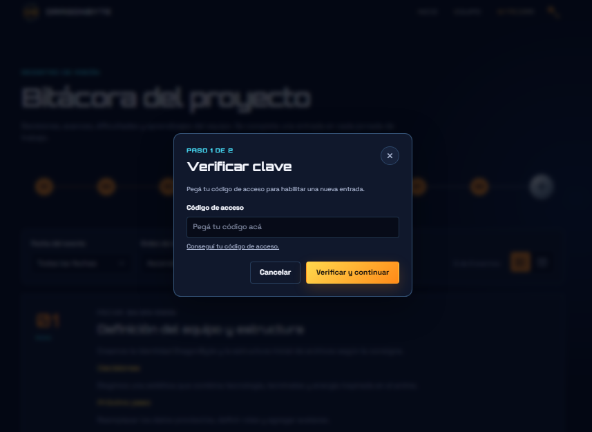

# DragonByte - TP1 Proyecto web en equipo

Sitio web grupal realizado para Desarrollo de Sistemas Web(Frontend).

**Publicación:** [DragonByte en Vercel](https://tp-1-front-end-grupo-23.vercel.app/).

## Integrantes

- Sebastián Fernández — [GitHub](https://github.com/Fernandez-Sebastian)
- Glaucia Ferreira — [GitHub](https://github.com/glaucia1906)
- Ignacio Grosman — [GitHub](https://github.com/IgnacioGrosman735)
- Andrea Maslucan Moreno — [GitHub](https://github.com/andreamm-lab)

## Tecnologías

- HTML5
- CSS3
- JavaScript
- Google Fonts: Orbitron y Space Grotesk

## Estructura

```text
TP1_FrontEnd_Grupo_23/
├── .editorconfig
├── .gitignore
├── index.html
├── assets/
│   ├── css/
│   │   ├── base.css
│   │   └── pages/
│   │       ├── inicio.css
│   │       ├── bitacora.css
│   │       └── perfiles.css
│   ├── js/
│   │   ├── bitacora-access.js
│   │   └── pages/
│   │       ├── inicio.js
│   │       └── bitacora.js
│   └── img/
│       ├── albums/
│       ├── iconos/
│       │   ├── dragonbyte.svg
│       │   ├── dragonbyte-header.svg
│       │   ├── dragonbyte-header-3d.png
│       │   ├── github.webp
│       │   ├── llave-bitacora.png
│       │   ├── nav-bitacora.png
│       │   ├── nav-equipo.png
│       │   ├── nav-inicio.png
│       │   └── ubicacion.webp
│       ├── peliculas/
│       ├── perfiles/
│       ├── sources-ignacio.json
│       └── sources-sebastian.json
├── components/
│   ├── bowling/
│   │   ├── bowling-audio.js
│   │   ├── bowling.css
│   │   └── bowling.js
│   ├── challenge/
│   │   ├── challenge.css
│   │   └── challenge.js
│   ├── footer/
│   │   ├── footer.css
│   │   └── footer.js
│   ├── header/
│   │   ├── header.css
│   │   └── header.js
│   └── member-photo/
│       ├── member-photo.css
│       └── member-photo.js
├── docs/
│   ├── page-1-inicio.png
│   ├── page-1-perfiles-modo-s.png
│   ├── page-1-game.png
│   ├── page-2-sebastian.png
│   ├── page-3-glaucia.png
│   ├── page-4-ignacio.png
│   ├── page-5-andrea.png
│   ├── page-6-bitacora-modo-lista.png
│   ├── page-6-bitacora-modo-compacto.png
│   ├── page-6-paso1-verificacion.png
│   └── page-6-forms.png
├── pages/
│   ├── bitacora.html
│   └── equipo/
│       ├── sebastian-fernandez.html
│       ├── glaucia-ferreira.html
│       ├── ignacio-grosman.html
│       └── andrea-maslucan-moreno.html
└── README.md
```

La portada está en `index.html`, la bitácora en `pages/bitacora.html` y los perfiles en `pages/equipo/`. Los estilos y scripts se organizan en `assets/css/` y `assets/js/`, y los componentes reutilizables en `components/`. Dentro de `assets/img/`, `perfiles/` guarda fotos y avatares; `iconos/`, las variantes del logo de DragonByte, la llave de la bitácora y los iconos de navegación, GitHub y ubicación; `albums/` y `peliculas/`, portadas y pósters. Los registros de fuentes son `sources-*.json`. Las once capturas del sitio están en `docs/` e ilustran el recorrido y el uso de la bitácora que se explican más abajo.

## Organización del código

Cada archivo tiene una responsabilidad y cada página carga los recursos que utiliza:

| Ubicación | Responsabilidad |
| --- | --- |
| `assets/css/base.css` | Variables de diseño, estilos base, tipografía, controles, layout común y marca compartida. |
| `assets/css/pages/` | Estilos específicos de portada, bitácora y perfiles, con sus ajustes responsive. |
| `assets/js/pages/inicio.js` | Botón de poder y animación del núcleo de la portada. |
| `assets/js/bitacora-access.js` | Clave de demostración compartida entre el juego de esferas y el formulario de bitácora. |
| `assets/js/pages/bitacora.js` | Entradas, formulario, filtros, orden y almacenamiento local de la bitácora. |
| `components/bowling/` | Pista de esferas, puntería, potencia, lanzamientos, derribo de palos y revelación de la clave al ganar. |
| `components/header/` | Encabezado, enlaces, estado de navegación y menú adaptable. |
| `components/footer/` | Pie de página y enlaces de navegación. |
| `components/member-photo/` | Retratos y transformación de fotos en portada y perfiles. |
| `components/challenge/` | Generación de desafíos y su diálogo en los perfiles. |
| `assets/img/perfiles/` | Fotos, avatares y retrato de reemplazo de los integrantes. |
| `assets/img/iconos/` | Iconos compartidos de GitHub y ubicación. |
| `assets/img/albums/` y `assets/img/peliculas/` | Portadas de discos y pósters de películas y series. |
| `assets/img/sources-*.json` | Registros de fuentes de las imágenes. |

El encabezado y el pie se mantienen en un único lugar. Para cambiar su contenido, editá la plantilla HTML dentro de su JavaScript. Cada página incluye los contenedores `data-site-header` y `data-site-footer`; los componentes resuelven sus enlaces desde la ubicación de sus scripts para funcionar también en páginas internas y despliegues bajo un subdirectorio.

Los scripts son clásicos, se cargan con `defer` y encapsulan su estado. La configuración de acceso se comparte mediante el objeto congelado `window.DragonByteAccess`; `bitacora-access.js` debe cargarse antes del juego y del formulario. Se conserva la apertura directa de los HTML, sin dependencias ni compilación. La navegación compartida requiere JavaScript habilitado.

## Convenciones de mantenimiento

- Usar nombres descriptivos en minúsculas y separados por guiones para archivos nuevos.
- Mantener el contenido de cada página en su HTML, su presentación en CSS y su comportamiento en JavaScript.
- Guardar en `base.css` solo estilos compartidos. Mantener cada componente con sus propios estilos, interacciones y ajustes responsive.
- Cargar primero `base.css`, después los retratos cuando correspondan, los estilos de la página y del desafío cuando corresponda, y al final el encabezado y el pie. Este orden conserva la cascada actual.
- Cargar los scripts del encabezado y pie en todas las páginas, y los demás solo donde se utilicen. Mantener `defer` y las rutas relativas.
- Respetar UTF-8, indentación de dos espacios y salto de línea final, definidos en `.editorconfig`.
- Al modificar un recurso con `?v=`, actualizar su versión en todas las páginas que lo carguen para evitar una copia anterior en caché.

## Cómo abrir el sitio

Abrí `index.html` directamente en el navegador con JavaScript habilitado. Los componentes se cargan mediante scripts clásicos, sin `fetch` ni una etapa de compilación.

Opcionalmente, desde la carpeta raíz podés iniciar un servidor local con Python:

```sh
python -m http.server 8000
```

Luego accedé a `http://localhost:8000/`. La bitácora estará en `http://localhost:8000/pages/bitacora.html` y los perfiles bajo `http://localhost:8000/pages/equipo/`.

## Guía de estilos

- Fondo: `#070b18`
- Superficie: `#10182c`
- Naranja: `#ff8a18`
- Amarillo: `#ffd84d`
- Cian: `#49e5ff`
- Texto principal: `#f6f8ff`
- Tipografías: Orbitron para títulos y Space Grotesk para texto.

## Funciones JavaScript

- Portada: el botón **Activar poder** cambia el estado visual y el mensaje del núcleo de energía.
- Esferas: el bowling de la portada comienza con **Empezar partida** y desafía a derribar diez palos en un máximo de tres lanzamientos. La pista ocupa todo el ancho y muestra la potencia en una barra vertical. Las cuatro flechas del teclado mueven la mira; mantené presionado el botón de lanzamiento con el mouse para cargar potencia y soltalo para lanzar. También se puede mantener y soltar Espacio con el botón enfocado, y usar los controles de dirección en pantallas táctiles. Las instrucciones están en **Ayuda**. Al finalizar aparece un cartel de victoria con la clave compartida de la bitácora o de **Game over**, con la opción **Volver a jugar**. **Reiniciar partida** vuelve al cartel inicial. La victoria no se guarda ni completa el formulario automáticamente.
- Sonidos del bowling: efectos de carga, lanzamiento, rodadura, impactos y resultados, generados en el navegador sin descargar archivos de audio. El botón **Sonido activado / Sonido silenciado** permite silenciarlos y recuerda la preferencia en ese navegador. El audio comienza con una interacción y se detiene al reiniciar o salir de la pestaña.
- Resultados por intento: al terminar cada lanzamiento aparece un popup con los palos derribados en ese tiro, el total y tres esferas que distinguen los intentos usados de los disponibles. La esfera se consume al lanzar; cancelar la carga conserva el intento. El resultado intermedio se cierra automáticamente a los dos segundos; Esc permite cerrarlo antes. El tiempo se reinicia al volver de la ayuda o de una pestaña oculta. El último tiro muestra este resumen junto con la victoria o el Game Over, que permanece visible para consultar la clave o volver a jugar.
- Navegación: el menú se abre y cierra en pantallas pequeñas.
- Retratos: las fotos alternan entre su estado base y su transformación.
- Perfiles: el botón **Generar desafío** propone un reto aleatorio de desarrollo.
- Bitácora: permite agregar entradas, filtrar por fecha y cambiar el orden. Al agregar una entrada, primero se pega y verifica el código de acceso; luego se habilita el formulario. Cada nueva entrada requiere verificar el código otra vez. Las entradas nuevas se guardan en `localStorage` del navegador; no se sincronizan entre integrantes. La verificación de la clave es local y de demostración.

## Capturas de pantalla

Este recorrido explica cómo usar el sitio con las imágenes guardadas en `docs/`. Hacé clic en cada captura para verla en tamaño completo.

### 1. Ingresar a la página de inicio

Abrí el sitio y recorré la presentación de DragonByte. Probá **Activar poder** para cambiar la energía del núcleo y presioná **Conocer al equipo** para bajar hasta las tarjetas de los integrantes. Desde el encabezado podés volver a **Inicio**, desplegar **Equipo** o entrar a **Bitácora**. En pantallas pequeñas, abrí **Menú** para ver los enlaces.

[](docs/page-1-inicio.png)

### 2. Interactuar con las tarjetas del equipo

En **Seleccioná un perfil**, hacé clic sobre la foto o en **Activar ki saiyajin** para transformar el retrato. Volvé a presionarlo para regresar al estado base. Cada tarjeta permite abrir el GitHub del integrante o entrar a su página mediante **Ver perfil**.

[](docs/page-1-perfiles-modo-s.png)

### 3. Recorrer los perfiles

Entrá a un perfil para leer su presentación y conocer sus habilidades. Hacé clic en los pósters de películas y series para abrir sus videos, o en las portadas de discos para escuchar música en YouTube. Al final de cada perfil, **Generar desafío** propone un reto de desarrollo.

Podés recorrer al equipo con las flechas junto al nombre, los botones inferiores o el menú **Equipo**. El siguiente recorrido comienza por Sebastián:

**Sebastián Fernández.** Revisá su experiencia, habilidades y favoritos; luego presioná **Siguiente perfil** para continuar con Glaucia.

[](docs/page-2-sebastian.png)

**Glaucia Ferreira.** Conocé su experiencia en backend y sus preferencias de cine y música. Usá **Siguiente perfil** para pasar a Ignacio o **Perfil anterior** para regresar.

[](docs/page-3-glaucia.png)

**Ignacio Grosman.** Explorá su recorrido como desarrollador Full Stack, sus habilidades y favoritos. Continuá con **Siguiente perfil** para conocer a Andrea.

[](docs/page-4-ignacio.png)

**Andrea Maslucan Moreno.** Leé su presentación, recorré sus películas y discos favoritos y probá el generador de desafíos. **Volver al equipo** te lleva nuevamente a las tarjetas de la portada. Para conocer el proceso de trabajo, entrá a **Bitácora** desde la navegación.

[](docs/page-5-andrea.png)

## Uso de la Bitácora

La bitácora reúne los avances, decisiones y próximos pasos del proyecto. Podés consultar las entradas sin clave; para agregar una nueva, primero tenés que obtener el código ganando en Dragon Bowling.

### 1. Consultar y organizar las entradas

Entrá a **Bitácora** y seleccioná un número de la línea de tiempo para ir al evento correspondiente. Usá **Fecha del evento** para filtrar un día o elegí **Todas las fechas** para ver el registro completo. En **Orden de los eventos**, seleccioná **Ascendente** o **Descendente** para ordenar por número de evento.

El control **Vista de lista** muestra las entradas una debajo de la otra, con su descripción, decisiones y próximo paso.

[](docs/page-6-bitacora-modo-lista.png)

Para ver los mismos eventos en una cuadrícula, presioná **Vista de tarjetas verticales**, junto a los filtros. Esta es la vista compacta de la siguiente captura; el navegador recuerda la vista elegida.

[](docs/page-6-bitacora-modo-compacto.png)

### 2. Jugar a Dragon Bowling y obtener la clave

Presioná el icono de la llave junto a **Bitácora** en el encabezado para ir al juego de la portada. También podés acceder desde **Arcade** en el pie de página.

1. Presioná **Empezar partida**. El objetivo es derribar los **10 palos en un máximo de 3 lanzamientos**; los palos derribados se conservan entre tiros.
2. Hacé clic en la pista y mové la mira con las cuatro flechas del teclado. En celular, usá los botones de dirección que aparecen debajo de la pista.
3. Mantené presionado **Cargar esfera** con el mouse o el dedo. Observá la barra vertical de potencia y soltá para lanzar; la zona recomendada está entre **70 y 90 %**.
4. Si usás teclado, enfocá la pista o el botón de lanzamiento: mantené y soltá **Espacio** para cargar y lanzar, o presioná **Enter** para lanzar al 80 %. **Esc** cancela la carga sin gastar un intento.
5. Revisá el resultado de cada tiro y ajustá la mira para derribar los palos restantes. Cada lanzamiento consume una esfera del contador de intentos. **Ayuda** permite consultar las instrucciones y el control de sonido permite silenciar los efectos.
6. Al derribar los diez palos aparece **¡Ganaste!** con la clave. Presioná **Copiar clave** y luego **Ir a la bitácora**. Si la copia automática falla, seleccioná el código y copialo manualmente.

Si agotás los intentos, **Volver a jugar** inicia otra partida con tres lanzamientos. **Reiniciar partida** vuelve al cartel inicial. Copiá la clave antes de salir: ganar no guarda la victoria ni completa automáticamente el formulario.

[](docs/page-1-game.png)

### 3. Verificar la clave para habilitar una entrada

En la bitácora, presioná **Agregar Evento** o el botón **+** al final de la línea de tiempo. Se abrirá **Verificar clave**, el primer paso del formulario. Pegá la clave del juego en **Código de acceso** y presioná **Verificar y continuar**. Si todavía no la tenés, el enlace **Conseguí tu código de acceso.** te lleva al juego.

[](docs/page-6-paso1-verificacion.png)

### 4. Completar y publicar el evento

Con la clave validada se abre **Nueva entrada**, el segundo paso. El **Número del evento** se asigna automáticamente. Elegí el **Tipo de evento**, revisá la **Fecha** y completá **Título del evento**, **Descripción**, **Decisiones** y **Próximo paso**. Finalmente, presioná **Publicar** para incorporar el evento a la bitácora, o **Cancelar** para salir sin publicarlo.

[](docs/page-6-forms.png)

Cada nueva entrada requiere verificar la clave otra vez. Las entradas se guardan en este navegador mediante `localStorage` y permanecen al recargar; no se sincronizan con otros navegadores ni con los demás integrantes. Si el navegador impide el almacenamiento, el sitio avisa que la entrada solo estará disponible durante la sesión. La verificación de la clave es local y de demostración.

## Pruebas de verificación hechas antes de entregar

- Abrir portada, bitácora y los cuatro perfiles; comprobar enlaces, imágenes y consola del navegador.
- Revisar el menú y la distribución en pantallas pequeñas y grandes.
- Probar el poder de la portada, los retratos y la apertura, regeneración y cierre de desafíos.
- Probar el arcade con mouse, teclado y controles táctiles; comprobar los tres intentos, el reinicio y que la clave solo se revele al derribar los diez palos.
- Probar filtros y formulario de bitácora en un navegador de prueba, y recargar para comprobar el **almacenamiento local**.
- Comprobar navegación con teclado, cierre de diálogos con Escape y preferencia de movimiento reducido.

## Imágenes obtenidas mediante APIs

En los perfiles se usó [iTunes Search API](https://developer.apple.com/library/archive/documentation/AudioVideo/Conceptual/iTuneSearchAPI/index.html) para obtener las portadas de discos y la [API PageImages de Wikipedia](https://www.mediawiki.org/wiki/Extension:PageImages) para los posters de películas. Las consultas son gratuitas y no requieren clave API. Las URLs obtenidas se incorporaron al HTML; la página carga las imágenes externas sin consultar las APIs en cada visita.

## Uso de IA

Se utilizó Codex de OpenAI para crear la estructura base, proponer la identidad visual y generar una primera versión de HTML, CSS y JavaScript. Esto nos permitió también organizar el proyecto de una manera más estructurada y descentralizar el codigo de los archivos principales. El equipo revisó, completo, adaptó y realizó las pruebas necesarias sobre todo el material antes del deploy oficial.
